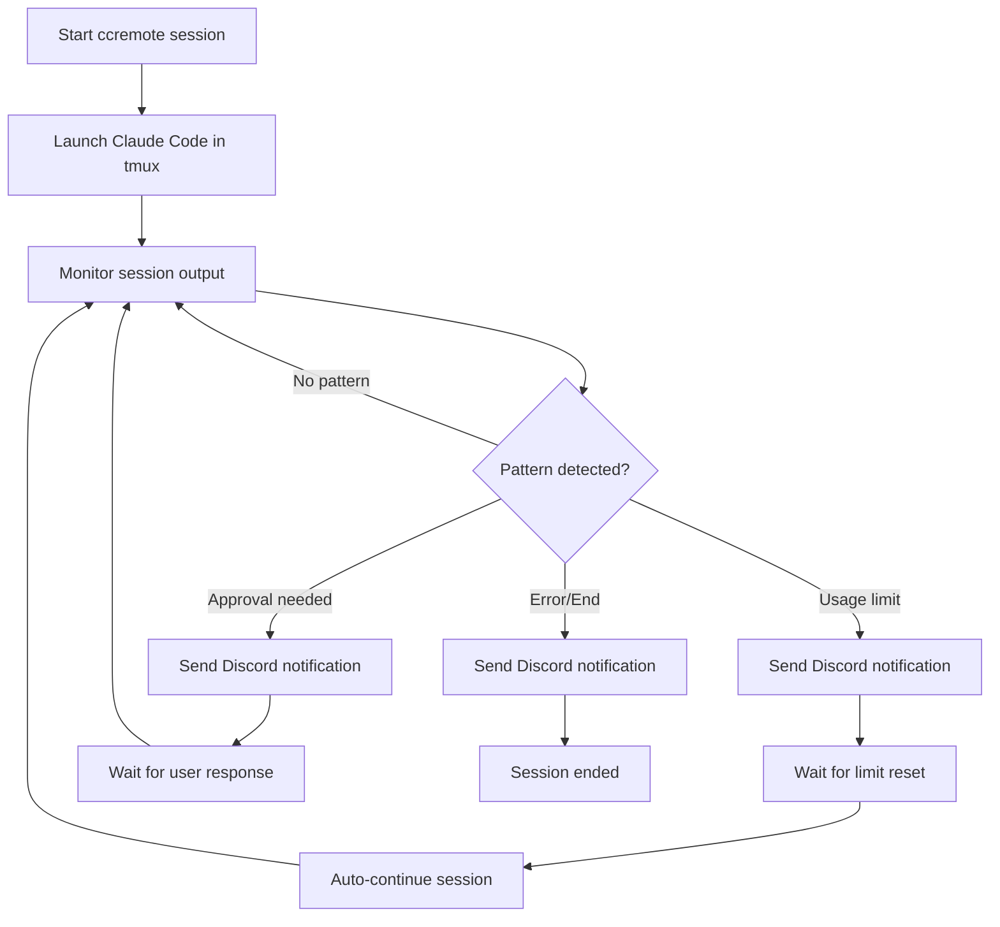

# What is ccremote?

ccremote is a CLI tool that provides remote control for Claude Code sessions with Discord integration. It monitors your Claude Code sessions automatically, continues them when usage limits reset, and provides Discord notifications for session events and approval requests.

## The Problem

When using Claude Code for extended coding sessions, you often encounter:

- **Usage limits** that interrupt your workflow
- **Long wait times** (typically 5 hours) for limits to reset
- **Manual intervention** required to continue sessions
- **Missing approval requests** when Claude Code needs user input
- **Lost context** when sessions end unexpectedly

## The Solution

ccremote solves these problems by:

- **🔄 Automatic Continuation**: Monitors your sessions and continues them automatically when limits reset
- **💬 Discord Notifications**: Sends real-time updates about session status, limits reached, and approval requests  
- **📱 Session Management**: Manages multiple Claude Code sessions simultaneously
- **🎯 Pattern Detection**: Intelligently detects usage limits, errors, and approval dialogs
- **🔒 Privacy Focused**: Each user creates their own Discord bot for complete privacy

## How It Works



## Key Features

### Automatic Session Continuation
When Claude Code hits a usage limit, ccremote:
1. Detects the limit message in the session output
2. Sends a Discord notification about the limit
3. Calculates when the limit will reset (typically 5 hours)
4. Automatically continues the session when the limit resets
5. Sends a confirmation notification

### Discord Integration
Get real-time notifications about:
- 🚫 **Usage limits reached** - Know immediately when your session is paused
- ✅ **Sessions continued** - Confirmation when your session resumes automatically
- ❓ **Approval requests** - When Claude Code needs your input for sensitive operations
- ❌ **Errors or session end** - When something goes wrong or your session ends

### Session Management
- Create multiple monitored sessions with custom names
- List all active and inactive sessions
- Check detailed status of any session
- Stop sessions gracefully or forcefully
- Automatic tmux integration with proper cleanup

### Privacy and Security
- **Per-user Discord bots**: Each user creates their own bot for complete privacy
- **Project-specific configuration**: Use separate configs for different projects/clients
- **Environment-based configuration**: No hardcoded credentials, secure by default
- **Local monitoring**: All monitoring happens locally on your machine

## Use Cases

### Long Coding Sessions
Perfect for extended development work where you might hit usage limits:
```bash
ccremote start --name "refactor-project"
# Work normally in Claude Code
# Get notified when limits hit, session continues automatically
```

### Client Work
Use project-specific Discord bots and configurations:
```bash
# Per-project configuration
echo "CCREMOTE_DISCORD_BOT_TOKEN=client_bot_token" > ./ccremote.env
ccremote start --name "client-project"
```

### Multiple Projects
Monitor several projects simultaneously:
```bash
ccremote start --name "project-a"
ccremote start --name "project-b"
ccremote list  # See all active sessions
```

## Next Steps

Ready to get started? Follow our guides:

1. **[Installation](./installation.md)** - Install ccremote and its dependencies
2. **[Quick Start](./quick-start.md)** - Get up and running in minutes
3. **[Discord Setup](./discord-setup.md)** - Create your Discord bot for notifications
4. **[Configuration](./configuration.md)** - Customize ccremote for your workflow